# Jokenpo ✊✋✌️

## About the project📜
Advanced back-end of Jokenpo game in Java, applying software engineering and architecture concepts, along with solid object-oriented principles and Clean Code.

The project resulted in an efficient, well-structured and cohesive game.

## Technologies used 💻⚙️
- Eclipse IDE
- JDK17

## Example of Project Operation

 
  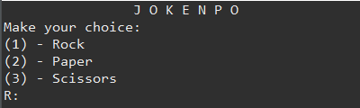
  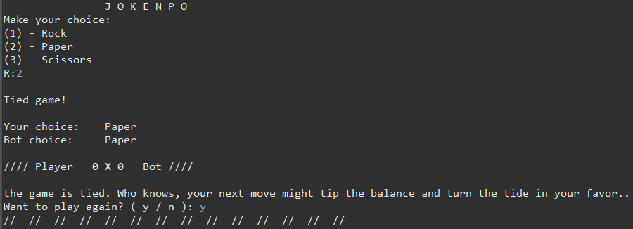
  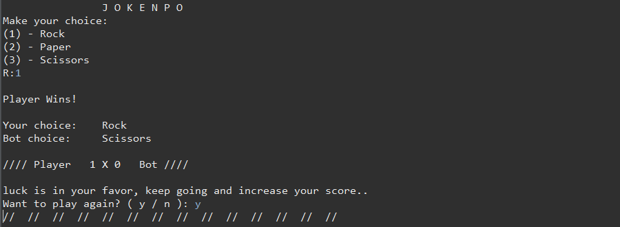
  
  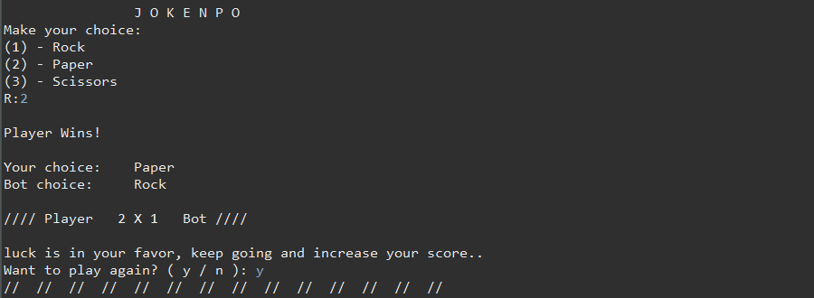
  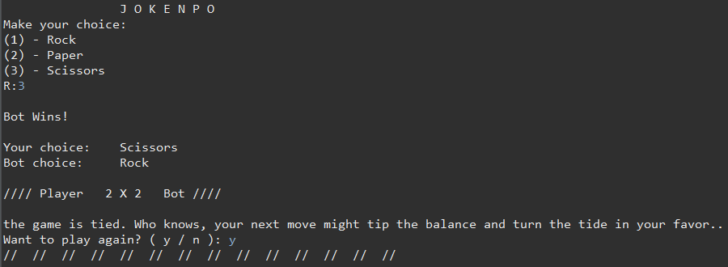
  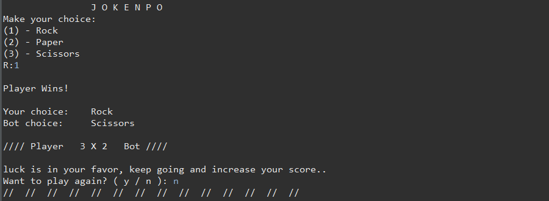
  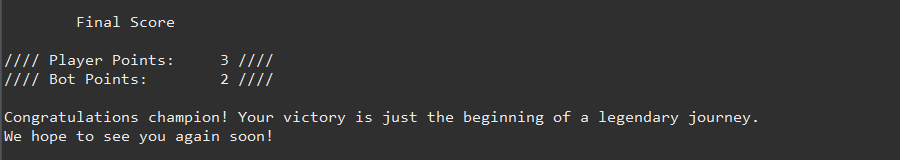

   <h3 align = "center">  Alternative endings </h3>

 
  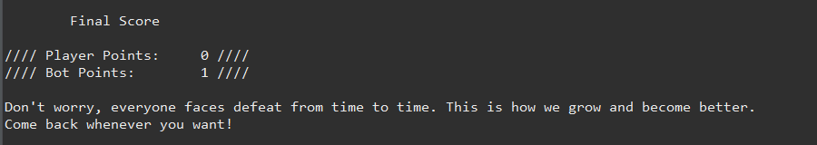
  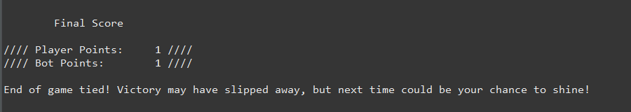

<h3 align = "center"> Handling exceptions </h3>

 
  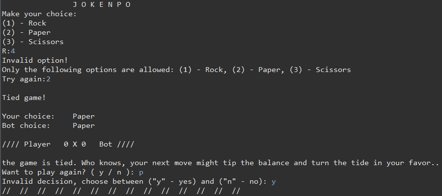
  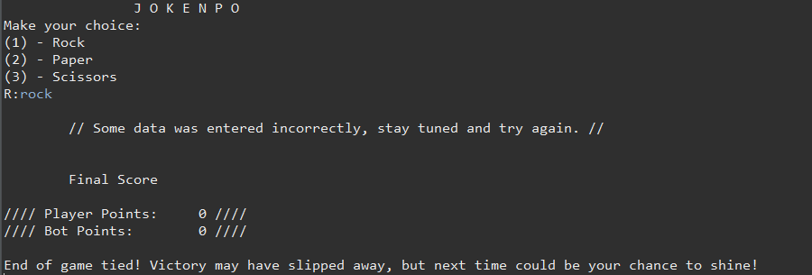

